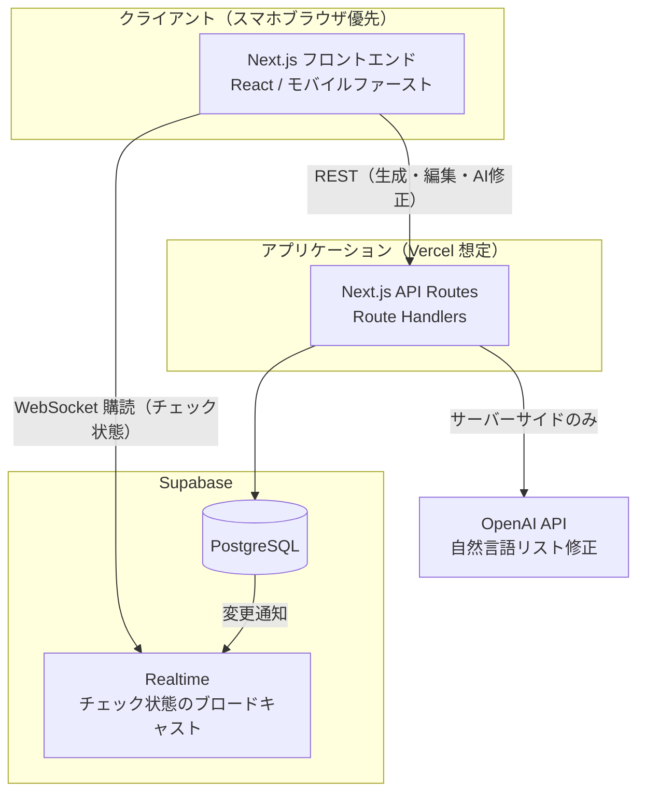
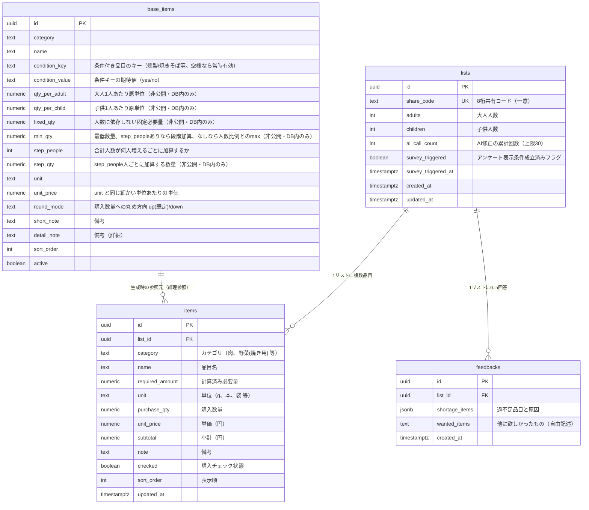
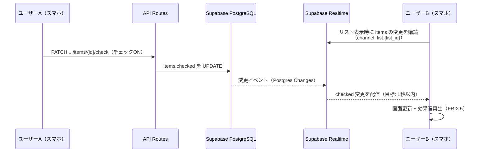

# アーキテクチャ・システム設計書

- 対象: BBQお買い物サポートアプリ
- 作成日: 2026-07-15
- 版数: v0.1（ドラフト）
- 参照: [docs/requirements.md](../docs/requirements.md)
- 関連: [specs/logic-design.md](logic-design.md)（計算・判定ロジックの詳細）

> **注意（NFR-2）**: 本書はリポジトリにコミットされ public 公開される。原単位の実値・補正係数・実績データは一切記載しない。本書中の数値例はすべてダミーである。

---

## 1. システム全体構成



### 1.1 技術スタック

| レイヤ | 技術 | 選定理由 |
|---|---|---|
| フロントエンド | Next.js (App Router) + React + TypeScript | 要件書 §6 の初期方針。API Routes と一体でデプロイでき、小規模構成に適する |
| スタイリング | Tailwind CSS | モバイルファースト（NFR-3）のユーティリティ設計と相性が良い |
| バックエンド | Next.js Route Handlers（`app/api/`） | 別サーバーを立てず運用コストを最小化（NFR-6：小規模想定） |
| DB / リアルタイム | Supabase（PostgreSQL + Realtime） | チェック状態の1秒以内反映（NFR-4）を Realtime 購読で実現 |
| AI 連携 | OpenAI API（Structured Outputs 利用） | 自然言語指示の解釈（FR-1.4）。呼び出しはサーバーサイド限定 |
| ホスティング | Vercel（想定） | Next.js との親和性 |

### 1.2 構成上の原則

1. **クライアントは Supabase に「購読のみ」直結する。** 書き込み（リスト編集・チェック更新）はすべて API Routes 経由とし、共有コードの検証・AI回数制限・入力バリデーションをサーバーで一元化する。
2. **秘匿情報（OpenAI API キー、Supabase service role キー）はサーバー環境変数のみに置く。** クライアントへは公開可能な anon キー＋Realtime 購読トークンのみ渡す。
3. **原単位マスタ（base_items）はサーバーからのみ参照可能**とし、クライアントに原単位の生値を露出させない（露出するのは計算後の必要量・数量のみ）。

---

## 2. データベース設計

### 2.1 ER 図



### 2.2 設計ポイント

- **`items` は生成時に原単位から計算した結果のスナップショット**を持つ。生成後の手動編集・AI修正は `items` のみを書き換え、`base_items` へは影響しない。原単位（`adult_unit` / `child_unit`）は `items` にコピーしない（クライアントに露出させないため。FR-1.2 の数量増減はサーバー側で `base_items` を再参照して行う。詳細はロジック設計書 §2.4）。
- **`share_code` に UNIQUE 制約 + インデックス。** 照合はこのカラムの完全一致のみ。
- **`base_items` は Row Level Security で anon からのアクセスを全面拒否**（service role のみ許可）。`lists` / `items` / `feedbacks` も anon の直接書き込みは拒否し、Realtime の購読（SELECT）のみ許可する。
- **有効期限なし（NFR-8）**: TTL・削除バッチは設けない。
- **Last Write Wins（NFR-7）**: バージョンカラム・楽観ロックは設けない。`updated_at` は監査目的のみ。
- 原単位マスタの本番データ投入は、`local/data/` の元データから **手元の投入スクリプトで直接 DB に登録**する（スクリプト自体はダミーデータ同梱でコミット可、実データは引数/ローカルファイル参照とし決してコミットしない）。

---

## 3. API 設計

すべて Next.js Route Handlers。共有コードを知っていることがアクセス権限そのものであるため、**リスト操作系 API は URL に共有コードを含め、サーバーで毎回検証する**。

| メソッド / パス | 機能 | 対応要件 |
|---|---|---|
| `POST /api/lists` | 人数（大人・子供）からリスト生成。共有コード発行 | FR-1.1, FR-2.1 |
| `GET /api/lists/{code}` | 共有コードでリスト取得（コード検証を兼ねる） | FR-2.2 |
| `PATCH /api/lists/{code}/items/{itemId}` | 品目の数量増減・編集 | FR-1.2, FR-1.3 |
| `POST /api/lists/{code}/items` | 品目追加 | FR-1.2 |
| `DELETE /api/lists/{code}/items/{itemId}` | 品目削除 | FR-1.2 |
| `PATCH /api/lists/{code}/items/{itemId}/check` | 購入チェックの ON/OFF | FR-2.3 |
| `POST /api/lists/{code}/ai-edit` | 自然言語指示によるリスト修正（差分プレビュー→適用の2段階。ロジック設計書 §4） | FR-1.4, FR-1.5 |
| `GET /api/lists/{code}/survey` | アンケート表示可否の判定 | FR-3.1 |
| `POST /api/lists/{code}/survey` | アンケート回答の保存 | FR-3.2, FR-3.3 |

### 3.1 API 共通仕様

- **認証**: なし。パス中の `{code}` が `lists.share_code` と完全一致しなければ `404` を返す（`401/403` とせず、コードの存在有無を推測させない）。
- **レート制限**: 共有コード総当たり対策として、`GET /api/lists/{code}` の失敗に対し IP 単位のレート制限を設ける（詳細な閾値はロジック設計書 §3.3）。
- **エラー形式**: `{ "error": { "code": string, "message": string } }` に統一。AI 回数上限到達は `429` + 専用コードで返す。

---

## 4. リアルタイム同期設計（FR-2.4 / NFR-4）



- **購読単位**: `list_id` でフィルタした `items` テーブルの Postgres Changes（UPDATE / INSERT / DELETE）。チェック状態だけでなく品目編集もこのチャネルで配信されるため、AI修正・手動編集も他ユーザーへ即時反映される。
- **自分の操作は楽観的更新**（API 応答を待たず即時に UI へ反映）し、Realtime の自己イベントは無視する。失敗時はロールバックする。
- **競合**: LWW（NFR-7）。同一品目への同時更新は後着の UPDATE がそのまま勝つ。クライアント側の警告・マージは行わない。
- 効果音は「自分の操作時」に再生する（FR-2.5）。他ユーザーの操作による変更受信時に鳴らすかは UI 設計時に決定（初期実装では鳴らさない）。

---

## 5. 画面構成（モバイルファースト / NFR-3, NFR-5）

| 画面 | パス | 内容 |
|---|---|---|
| トップ | `/` | 「新しいリストを作る」（人数入力）と「共有コードで開く」（8桁入力）の2導線 |
| リスト作成 | `/new` | 大人・子供人数の入力 → 生成 → リスト画面へ遷移 |
| 買い物リスト | `/list/{code}` | カテゴリ別品目一覧、チェック操作、数量編集、AI修正入力欄、共有コード表示・コピー |
| アンケート | リスト画面内モーダル | FR-3.1 の条件成立時に1回だけ表示 |

- URL に共有コードを含めるため、**URL をそのまま共有すればアクセスできる**（コード入力の代替手段）。
- チェック解除時は確認ダイアログを挟む（FR-2.6）。
- 骨付き肉モチーフのキャラクターをヘッダー・空状態・完了時などに配置する（NFR-5）。
- 効果音アセットは静的ファイルとして同梱し、初回タップで AudioContext を初期化する（モバイルブラウザの自動再生制限対策）。

---

## 6. セキュリティ・秘密データ設計（NFR-2）

| 項目 | 方針 |
|---|---|
| OpenAI API キー | サーバー環境変数（`OPENAI_API_KEY`）。`.env*` は `.gitignore` 済み |
| Supabase service role キー | サーバー環境変数のみ。クライアントには anon キーのみ配布 |
| 原単位マスタ | DB（`base_items`）のみで保持。RLS で anon 拒否。API レスポンスにも原単位の生値は含めない |
| `local/` `local_ref/` | `.gitignore` 済み。コミット・push 禁止。コード・テスト・ドキュメントへの実値転記禁止 |
| リポジトリ同梱データ | サンプル／ダミーデータのみ（シード用 `seed/sample_base_items.csv` 等） |
| 共有コード | CSPRNG による生成（ロジック設計書 §3）。生成方式の弱点となる情報（シード等）をリポジトリに残さない |

---

## 7. ディレクトリ構成（実装時の想定）

```
bbq_support_01/
├── app/                  # Next.js App Router
│   ├── api/              # Route Handlers（§3 の API）
│   ├── list/[code]/      # リスト画面
│   └── new/              # リスト作成画面
├── lib/
│   ├── supabase/         # クライアント生成（server/client 別）
│   ├── logic/            # リスト生成・計算ロジック（ロジック設計書 §2）
│   ├── ai/               # OpenAI 連携（ロジック設計書 §4）
│   └── share-code.ts     # 共有コード生成・検証
├── seed/                 # ダミー原単位データ + 投入スクリプト
├── docs/                 # 要件書
├── specs/                # 設計書（本書）
├── local/                # 秘密データ（Git 管理外）
└── local_ref/            # 秘密参照データ（Git 管理外）
```

---

## 8. 非機能対応まとめ

| 要件 | 対応 |
|---|---|
| NFR-1 永続化 | Supabase PostgreSQL に全データ保存 |
| NFR-2 非公開化 | §6 参照 |
| NFR-3 モバイルファースト | Tailwind によるスマホ最優先レイアウト。PC は崩れない程度 |
| NFR-4 リアルタイム 1秒 | Supabase Realtime（Postgres Changes）+ 楽観的更新 |
| NFR-5 デザイン | 骨付き肉キャラクター配置 |
| NFR-6 規模 | 単一 Vercel + Supabase 無料〜小規模プランで足りる構成。スケールアウト設計はしない |
| NFR-7 競合制御 | Last Write Wins。ロック機構なし |
| NFR-8 保持期限 | 無期限。削除処理なし |
