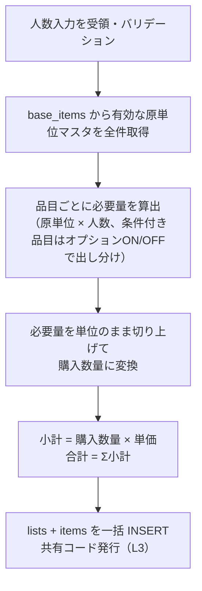
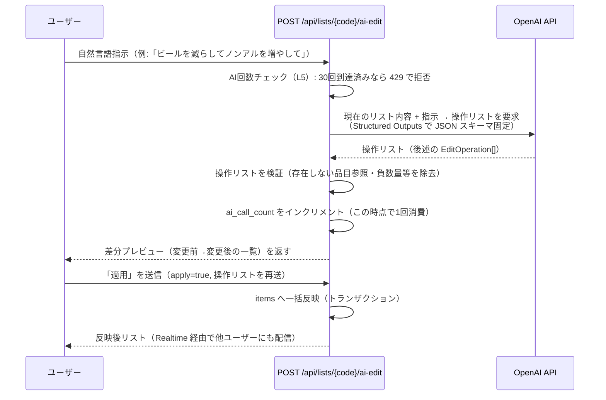
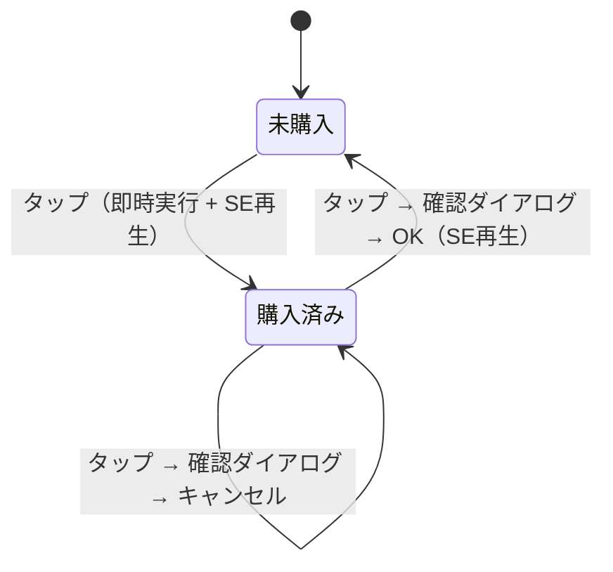
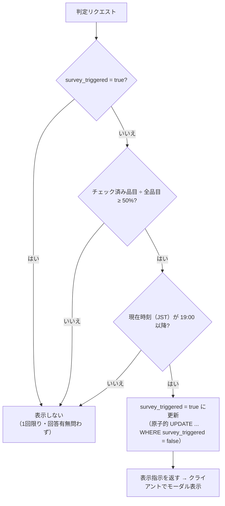

# ロジック設計書

- 対象: BBQお買い物サポートアプリ
- 作成日: 2026-07-15
- 版数: v0.1（ドラフト）
- 参照: [docs/requirements.md](../docs/requirements.md)
- 関連: [specs/architecture.md](architecture.md)（システム構成・DB・API の全体像）

> **注意（NFR-2）**: 本書はリポジトリにコミットされ public 公開される。原単位・補正係数の**実値および具体的な補正計算式は本書に記載しない**。それらは DB（`base_items` ほか）側で保持し、本書では「どこで・どう扱うか」の構造のみを定義する。本書中の数値例はすべてダミーである。

---

## 1. ロジック一覧と配置

| # | ロジック | 実行場所 | 対応要件 |
|---|---|---|---|
| L1 | 買い物リスト生成（必要量・購入数量・金額計算） | サーバー（`lib/logic/`） | FR-1.1 |
| L2 | 品目の手動編集（増減・追加・削除） | サーバー | FR-1.2, FR-1.3 |
| L3 | 共有コードの生成・検証 | サーバー（`lib/share-code.ts`） | FR-2.1, FR-2.2, NFR-2 |
| L4 | AI によるリスト修正（差分生成→適用） | サーバー（`lib/ai/`） | FR-1.4 |
| L5 | AI 呼び出し回数制限（累計30回） | サーバー + DB | FR-1.5 |
| L6 | 購入チェックの状態遷移 | クライアント + サーバー | FR-2.3〜FR-2.6 |
| L7 | アンケート表示判定 | サーバー | FR-3.1 |

計算・判定はすべてサーバーで行い、クライアントは表示と楽観的更新のみを担う。原単位を扱う L1・L2・L4 をクライアントに置かないことが NFR-2 の前提となる。

---

## 2. L1: 買い物リスト生成ロジック

### 2.1 入力・出力

- **入力**: 大人人数 `adults`（1〜99）、子供人数 `children`（0〜99）
- **出力**: `items` レコード群（カテゴリ、品目名、必要量、単位、購入数量、単価、小計、備考）＋リスト合計金額

### 2.2 処理フロー



### 2.3 各ステップの仕様

1. **必要量の算出**: 品目ごとに、以下の優先順位で必要量を求める（原単位・固定量・条件の実値は `base_items` にのみ持たせ、コードにハードコードしない。NFR-2）。
   - 最低数＋人数刻み加算が定義された品目（`min_qty` と `step_people` を両方持つ行）: `必要量 = min_qty + floor((大人人数+子供人数) ÷ step_people) × step_qty`。参加人数が一定数増えるごとに数量を段階的に増やしたい道具類（鍋等）向け。
   - 人数に依存しない固定量の品目（雑貨・調味料等の常備品。`fixed_qty` を持つ行）: 固定値をそのまま必要量とする。
   - それ以外（人数比例）の品目: `必要量 = 大人原単位 × 大人人数 + 子供原単位 × 子供人数`。`min_qty` のみ設定されている行は、この比例計算値と `min_qty` の大きい方を採用する（少人数でも最低量は確保する。例: バター最低1パック）。
   - 上記いずれの場合も、品目ごとに定義された気温補正対象（例: ビール）は、気温オプション（普通/暑い/涼しい）に応じて必要量を ×1.0 / ×1.25 / ×0.75 で補正する。対象品目はコード側の定数で管理する（NFR-2の対象外＝係数自体は非公開データではないため）。
   品目には人数入力とは別に ON/OFF 切り替え可能な条件（燻製・焼きそば・アヒージョ・朝食・スモア・ご飯物 等）があり、条件に合致しない品目はリストに含めない。
2. **購入数量への変換**: 単価は原単位と同じ細かい単位（g・本 等）あたりで管理するため、パック・袋単位への換算は行わない。品目ごとの丸め方向（`round_mode`。既定は切り上げ、一部品目のみ切り下げ）に従って必要量を整数化した値を購入数量とする。切り下げの結果、購入数量が0になる品目は購入対象から外れる（少人数時の想定挙動）。
3. **金額計算**: `小計 = 購入数量 × 単価`。金額はすべて円の整数に丸める（四捨五入）。合計はリスト画面でヘッダー表示する。
4. **必要量が 0 になる品目**（例: 子供 0 人のとき子供専用品目）はリストに含めない。ただし数量 0 でも定番として常に含める品目（雑貨・燃料等）はマスタ側のフラグで制御する。

### 2.4 生成後の人数変更（AI 修正「子供を3人増やして」等）

人数変更を伴う修正では、**手動編集済み品目の扱い**が問題になる。方針:

- 人数変更時は各品目の必要量・購入数量を再計算する（`base_items` を再参照）。
- ただし **ユーザーが手動で数量を変更した品目**（`items` に手動編集フラグを持たせる）は再計算対象から除外し、現在値を維持する。
- ユーザーが手動追加した品目（原単位マスタに存在しない品目）は再計算せず現在値を維持する。

---

## 3. L3: 共有コード生成・検証ロジック

### 3.1 生成

- **形式**: 8桁、文字種は `0-9` および紛らわしい文字（`I,L,O` 等）を除いた大文字英字からなる約30文字の集合。組み合わせは 30^8 ≒ 6.5×10^11 通りで、レート制限（§3.3）と併用すれば総当たりは現実的でない。
- **生成方式**: 暗号論的に安全な乱数（Node.js `crypto.randomInt` / `crypto.getRandomValues`）で1文字ずつ選択する。`Math.random` は使用禁止。時刻・リストIDなど推測可能な値をシードや材料に使わない。
- **一意性**: `lists.share_code` の UNIQUE 制約に任せ、衝突時（INSERT 失敗時）は再生成してリトライ（最大5回）。
- **表示**: UI では読みやすさのため `XXXX-XXXX` と4桁区切りで表示するが、保存・照合は8文字連結で行う（入力時はハイフン・小文字を正規化）。

### 3.2 検証

- 入力コードを正規化（trim・大文字化・ハイフン除去）→ 形式チェック（8文字・許可文字種）→ DB 完全一致検索。
- 不一致時は**存在しないのか形式不正なのかを区別しない**同一のエラー（HTTP 404 相当）を返す。

### 3.3 総当たり対策（レート制限）

- コード検証エンドポイントに対し、IP 単位で「失敗 N 回/分を超えたら一定時間拒否」の固定ウィンドウ制限を入れる（初期値: 10回/分・超過時60秒拒否。運用で調整）。
- 実装は Vercel 上で完結させるため、まず DB テーブル（`rate_limits`）による簡易実装とし、負荷が問題になれば Upstash 等の外部ストアへ移行する。

---

## 4. L4: AI によるリスト修正ロジック

### 4.1 全体フロー（差分プレビュー方式）

FR-1.4 の「修正前後の差分が分かる形で提示」を満たすため、**AI の出力を直接 DB に書かず、差分（操作リスト）として返してユーザー確認後に適用する** 2 段階方式とする。



- 回数消費は **OpenAI API を呼び出した時点**（プレビュー生成時点）で 1 回とする。適用・破棄は消費に影響しない。
- ユーザーが差分を破棄した場合、DB は変更されない。

### 4.2 AI への入出力仕様

- **入力（プロンプト構成）**: システムプロンプト（役割・出力スキーマ・禁止事項）＋現在の品目一覧（id、カテゴリ、品目名、数量、単位、単価。**原単位は渡さない**）＋人数＋ユーザー指示文。
- **出力スキーマ（EditOperation）**: Structured Outputs で以下に固定する。

```jsonc
{
  "operations": [
    { "op": "update_qty", "item_id": "…", "new_qty": 3 },
    { "op": "add_item", "category": "飲み物", "name": "ノンアルビール",
      "qty": 6, "unit": "本", "unit_price": 180 },   // 値はダミー例
    { "op": "delete_item", "item_id": "…" },
    { "op": "change_headcount", "adults": 10, "children": 5 }
  ],
  "summary": "ビールを6本減らし、ノンアルビールを6本追加しました"
}
```

- `change_headcount` が含まれる場合は §2.4 の再計算を実行する。
- **検証ルール**（サーバー側で AI 出力を信用しない）: 存在しない `item_id` の操作は無視、数量は 0〜999 にクランプ、単価は 0 以上、1回の操作数上限 50。全操作が無効な場合はエラーとしてユーザーに再指示を促す（回数は消費済み）。

### 4.3 失敗時の扱い

- OpenAI API のエラー・タイムアウト（30秒）時は回数を**消費しない**（インクリメント前に失敗させる）。
- スキーマ不一致応答は 1 回だけ自動リトライし、それでも失敗なら回数消費なしでエラー返却。

---

## 5. L5: AI 呼び出し回数制限（累計30回）

- `lists.ai_call_count` を単一のカウンタとして使用。上限は定数 `AI_EDIT_LIMIT = 30`。
- **チェックとインクリメントは原子的に行う**: `UPDATE lists SET ai_call_count = ai_call_count + 1 WHERE id = ? AND ai_call_count < 30 RETURNING ai_call_count` — 更新行が 0 なら上限到達として 429 を返す。複数ユーザーが同時に AI 修正しても 30 回を超えない。
- 残回数（`30 - ai_call_count`）はリスト取得 API に含め、UI で常時表示する。上限到達時は AI 入力欄を無効化し、通知メッセージを表示する（手動編集は引き続き可能。FR-1.5）。

---

## 6. L6: 購入チェックの状態遷移



- **チェック ON**: 確認なしで即時実行（FR-2.3）。
- **チェック OFF**: 確認ダイアログを表示し、明示的な確認後に解除（FR-2.6）。ダイアログには品目名を表示する（「『牛肉』のチェックを外しますか？」）。
- **楽観的更新**: タップ時に即座に UI とローカル状態を更新し、API 失敗時は元に戻してトースト表示。
- **効果音（FR-2.5）**: ON/OFF それぞれ専用 SE を自分の操作時に再生。連打時は再生を重ねず打ち切り再生とする。
- **他ユーザーからの反映**: Realtime イベント受信時、該当品目のみ再描画。自分が出した更新のエコーは client-generated な操作IDで判別して無視する。
- **競合（NFR-7）**: LWW。ほぼ同時に A が ON・B が OFF した場合、DB に後着した方が最終状態となり、両者の画面は Realtime 経由で最終状態に収束する。

---

## 7. L7: アンケート表示判定ロジック

### 7.1 判定条件（FR-3.1）

「品目の 50% 以上が購入済みとなった日の 19 時以降、1リストにつき1回限り」。

- タイムゾーンは **JST（Asia/Tokyo）固定**で判定する。
- 判定はリスト画面ロード時および品目チェック更新時に、`GET /api/lists/{code}/survey` で問い合わせる（サーバープッシュはしない。19時をまたいで開きっぱなしのケースは、次の操作 or リロード時に拾えれば十分とする）。

### 7.2 判定フロー



- **「表示した」＝条件成立**とみなし、`survey_triggered` を立てた時点で以後は再表示しない（回答の有無は問わない。要件書 §9）。
- フラグ更新は `WHERE survey_triggered = false` 付き UPDATE で行い、複数ユーザーの画面で同時に条件成立しても**最初の1リクエストだけ**が表示指示を受け取る（＝リスト単位で1回。同一リストを開いている複数人のうち1人にのみ表示される）。
- 50% の分母は判定時点の全品目数（削除済みは除く）、分子は `checked = true` の品目数。
- 「〜した日の19時以降」について: 50% 到達日と閲覧日が異なる場合（翌日以降に開いた場合）も、条件（50%以上 かつ 19時以降）を満たしていれば表示する。厳密な「到達当日」限定はせず、シンプルな AND 条件とする（到達日を過ぎた表示も、買い出し直後の記憶があるうちのフィードバックとして有効なため許容）。

### 7.3 回答の保存（FR-3.2, FR-3.3）

- `feedbacks` に INSERT。`shortage_items` は `[{ "item_name": "…", "kind": "excess|shortage", "reason_choice": "…", "reason_text": "…" }]` の JSONB、`wanted_items` は自由記述テキスト。
- 本バージョンでは保存のみ（原単位への自動反映はスコープ外）。分析は DB を直接参照して行う。

---

## 8. バリデーション一覧（サーバー共通）

| 対象 | ルール |
|---|---|
| 大人人数 | 整数 1〜99 |
| 子供人数 | 整数 0〜99 |
| 品目名 | 1〜50 文字 |
| カテゴリ | 1〜30 文字 |
| 購入数量 | 0〜999 |
| 単価 | 0〜999,999 円（整数） |
| 備考 | 0〜200 文字 |
| AI 指示文 | 1〜500 文字 |
| アンケート自由記述 | 0〜1,000 文字 |

## 9. テスト観点（実装時の受け入れ基準の種）

- L1: 人数の境界値（大人1/子供0、最大値）で生成結果の品目数・合計が妥当（ダミーマスタで検証）
- L3: 生成コードの文字種・桁数、衝突リトライ、レート制限の発動
- L4: AI 出力の不正値（存在しない item_id、負数）が適用されないこと。差分破棄で DB 不変
- L5: 並行 30 回超呼び出しでカウンタが 30 を超えないこと
- L6: チェック OFF 時に確認なしで解除されないこと。楽観的更新のロールバック
- L7: 50% 境界・19:00 境界（JST）・二重表示防止の原子性
